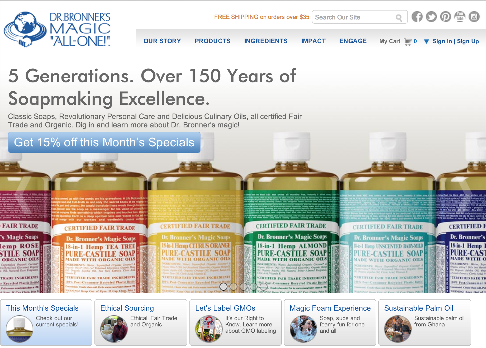
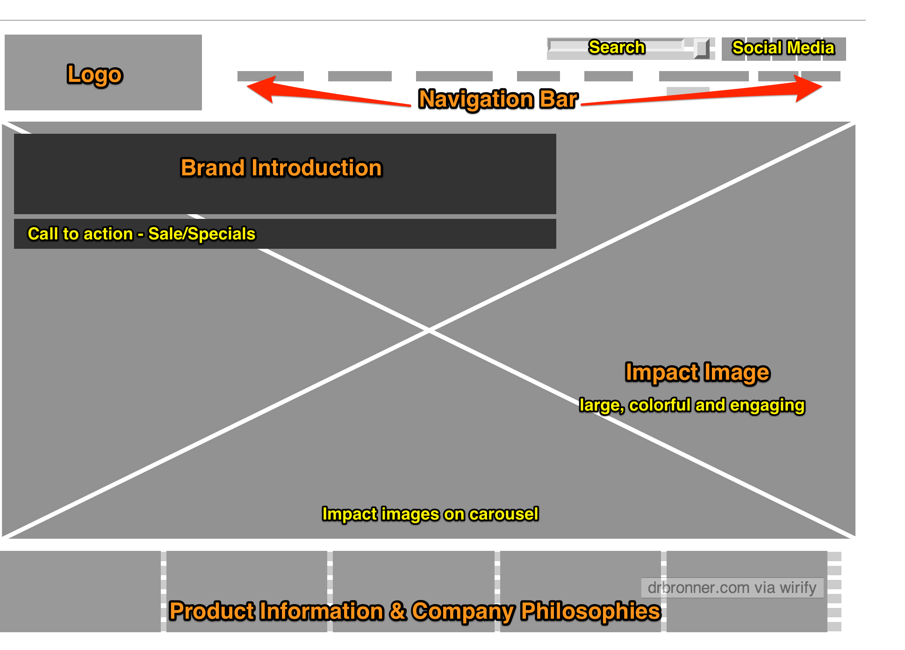
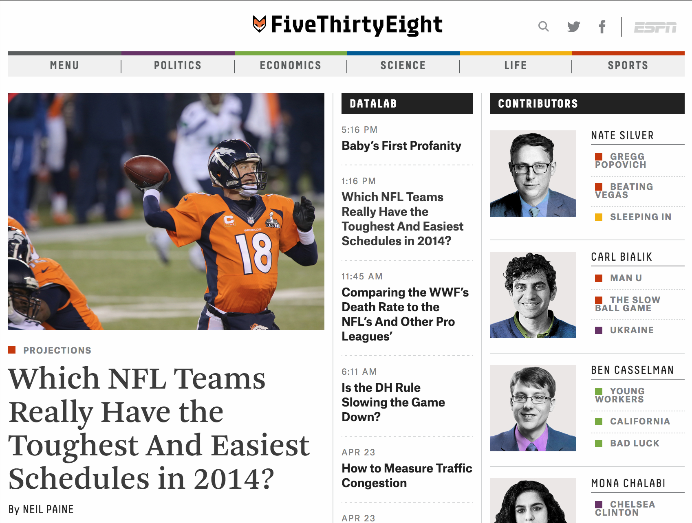
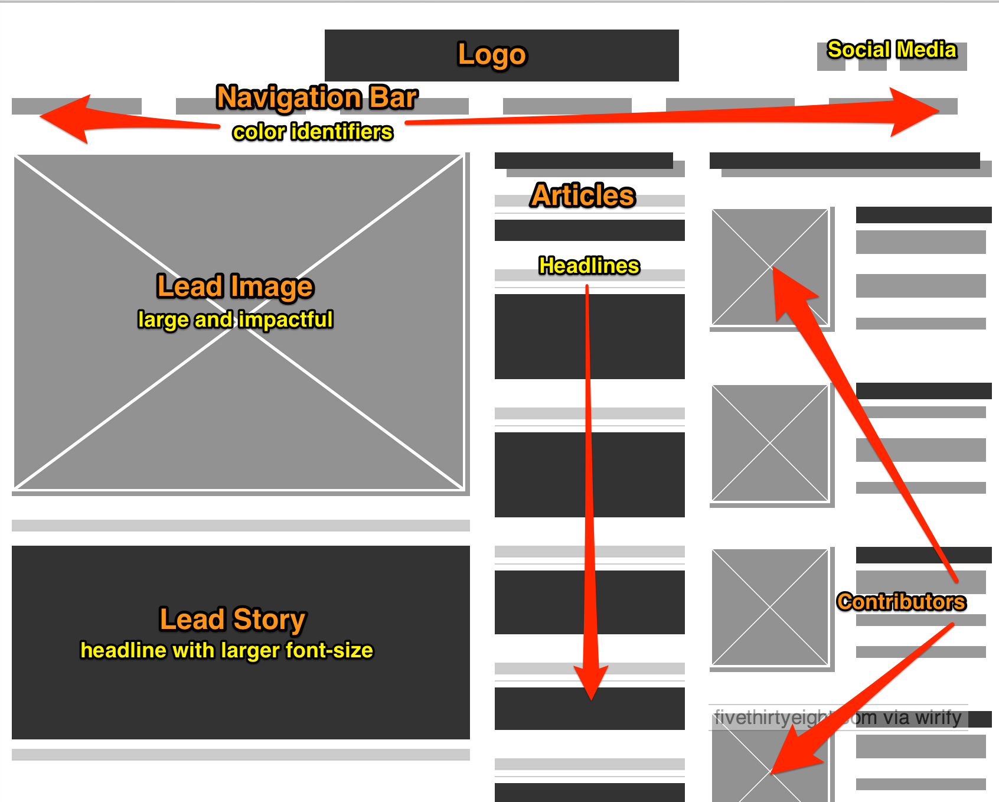
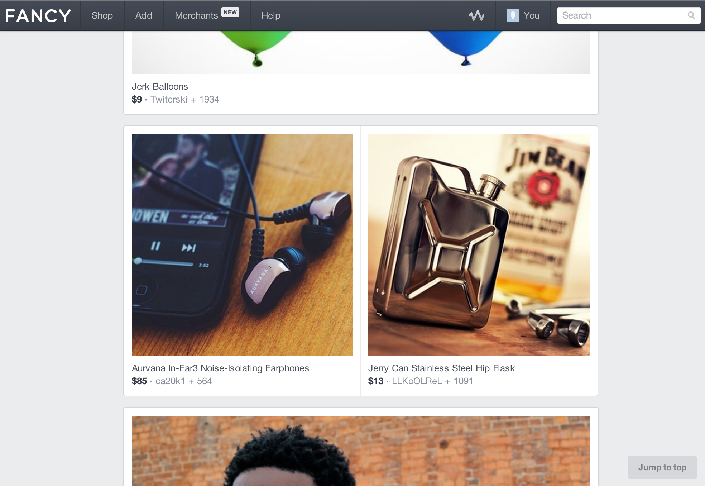
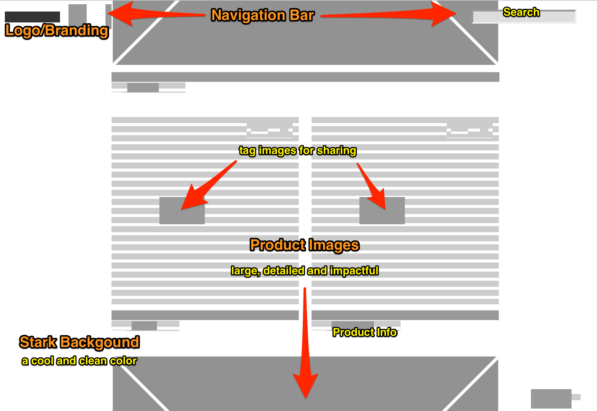

### [drbronners.com](https://www.drbronner.com/)

The website is geared toward commerce. The problem that the homepage is solving is providing a means for consumers to purchase its product. It also has a strong secondary purpose, to educate and inform consumers around its business practices and company philosophies. I believe one of its visual challenges is to convey excitement and interest around what is basically just soap. This is achieved through a colorful and impactful image in its main content area that is surrounded by what is otherwise a clean white environment.

#### Website Screenshot

<figure></figure>

#### Wireframe Screenshot

<figure></figure>

### [fivethirtyeight.com](http://fivethirtyeight.com/)

The website is a news outlet. The problem that the homepage is solving is providing a data driven source of information to its readers. As a relatively new news source it is also providing branding and engagement around its content providers. One of its visual challenges is to be different in a crowded news outlet arena while maintaining its roots in data driven reporting. The site makes frequent use of charts and graphs and perhaps takes its visual design clues from such. The layout is clean and relatively flat with limited use of color added for impact. Photographs and images are used to introduce stories rather than telling them.

#### Website Screenshot

<figure></figure>

#### Wireframe Screenshot

<figure></figure>

### [fancy.com](http://fancy.com/) 

The website is geared to commerce. The problem that the homepage is solving is providing a means for, and directing consumers to curated products. Its visual challenges are displaying goods for purchase while engaging its consumers to socialize and build collections. The site is presented as a stark environment where the images of goods for sale garner all the attention. The user can build their own collections for display as well as control how the images are displayed. This gallery or museum setting goes toward solving its visual challenge while maintaining its curated quality.

#### Website Screenshot

<figure></figure>

#### Wireframe Screenshot

<figure></figure>