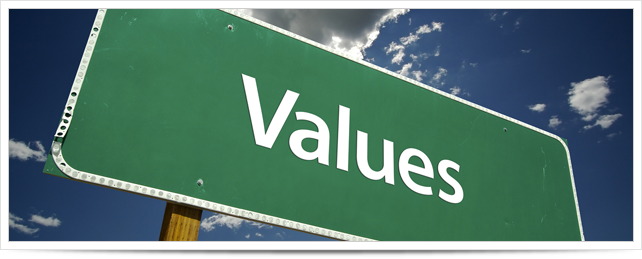

When I think about the times in my life that I've been the proudest, happiest or most satisfied, the value that comes to mind is Public Service or Service more generally.

<figure></figure>

I can remember back to my years after college. It was during this phase that I participated in the [Up with People](http://www.upwithpeople.org) organization. I was originally drawn to the program for its performance aspects. While I do have fond memories of that, it was the service aspects that changed me the most. A large component of the program was that in each town or city we performed in, the cast participated in some sort of community project. Whether I was painting a mural, teaching inner city elementary students or visiting the often forgotten in a nursing home, the goal was the same, being of service.

Even more recently in professional life as a Manager. When I think about being a leader to my team, it was through my service to them that I achieved the most success. In identifying their needs and goals, I was able to establish a path where I could help them reach those things to the benefit of all parties. Whether I was helping a front line employee master their customer service skills, creating a cooperative environment for my team to reach our monthly goals or supporting a team member that was hungry for a promotion to obtain the skills necessary to land that promotion, the goal was the same, being of service.

When I think about the times in my life that I've been the proudest, happiest or most satisfied, it has been when I was at service to others. I'd like to say that in general, I always try to live up to that value. Truth be told, I can just as easily think of times when I've subverted that value for monetary gain, status or just because I perceived it easier not to. Those are also the times in my life that I've not been the proudest, happiest or even slightly satisfied. In those times the goal was self service.

Now as I look to start a new chapter in my life, both personally and professionally, I call upon that value. Whether it's a peer asking for help on debugging their code or working through a challenge, a friend calling to ask about career advice or a former colleague seeking guidance in dealing with a new supervisor, the goal will be the same, being of service.

