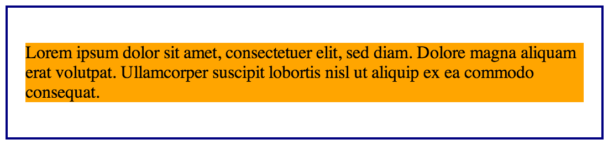

So you've been getting to know a little about CSS. Perhaps you've learned that your HTML is built using tags which create elements. For example, you might have seen `header`, `nav`, `div` and `p`. You can style those elements in CSS with all kinds of fun modifications. Before you jump in to far however, you should know a little about how those elements display by default and how you can modify them.

### Block

By default, many of the more common elements will display as blocks. Basically, that means they will take up the entire width of the area they're in. For example, a `p` which is a paragraph element will fill a column entirely with its text. Let's have a look.


<body>
	<section>
		
Lorem ipsum dolor sit amet, consectetuer elit, sed diam. Dolore 
		magna erat volutpat. Ullamcorper suscipit lobortis nisl ut aliquip 
		ex ea commodo conseqat.

	</section>
</body>


section {
    margin: 3em auto;
    width: 40%;
    border: 2px solid navy;
    padding: 1em;
}
p {
    background-color: orange;
}


<figure></figure>

I've added a bit of styling to create our section border. As for the paragraph, I've only added some back ground color. You can see the `p` element fills the entire space.

### Inline

Now let's look at inline. While `p` had a default display of block, tags such as `em` and `strong` have default display of inline. Basically, they display that element inline with its surroundings but they are contained by their surrounds dimensions. Let's take a look.


<body>
  <section>
    
Lorem ipsum dolor sit amet, consectetuer elit, sed diam. Dolore 
    magna erat volutpat. Ullamcorper suscipit <strong>lobortis</strong> 
    nisl ut aliquip ex ea commodo conseqat.

  </section>
</body>


strong {
    background-color: yellow;
}


<figure></figure>

A `strong` tag is quick way to bold a particular element. I again added only some background color to this element. You can see it is within or inline with its surrounds with our changing its dimensions.

### Inline-block

What about inline-block. Well this allows us to create a new block element. This time however, while it continues to be within or inline with its surroundings, we can adjust its dimensions. Let's take a look.


strong {
    background-color: yellow;
    display: inline-block;
    text-align: center;
    width: 6em;
    height: 3em;
}


<figure></figure>

By adding changing the display value of the strong element to inline-block, we created a whole new block that we were able to scale. While I used text and `strong` to walk through these examples, perhaps a more common and useful use of inline-block is with `img` elements. This allows you to add images within the context of it surrounding text without filling the entire width of the section.
