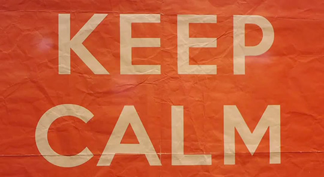

Conflict is all around us. One person thinks this. Another company does that. You did this. I do that. When conflict does arise, how do you deal with it? More over, how did you feel after the conflict? Well, for most of us, when confronted with conflict we process through it and the subsequent shame in one of four ways. As described by the [Compass of Shame](http://southdown.on.ca/publications/articles/Compass-of-Shame.pdf), we either go into withdrawal, attack self, avoidance or attack others.

Let me share a personal example of conflict and what I’ve learned through hindsight. Early on in my career, I was working as a Sales Associate for a retail company. I was young but wanted to do well and advance. One day, a guest entered our store and inquired about a return. I offered to assist the gentleman. In going through the steps to complete his request, I discovered he didn't possess an invoice for the item he wanted to return. I explained that the company policy required the original invoice and without it I wouldn't be able to assist.

As you can imagine, this didn't sit well with him and he quickly became angered and began berating me. In my head, I felt like I was doing the right thing. I was following my companies policies and procedures and ultimately it wasn't my fault he didn't retain his receipt. I soon began to feel inferior and seek ways to withdraw from the situation. It escalated to the point of him demanding to speak to my superior until he was able to get his way.

What I’ve learned about conflict and my reaction to it, especially after a situation like this, is two fold. In the immediate sense, while I was “right” in following policies, it left the guest promising never to shop with us again and it left me feeling beaten up. Things aren’t always, and in fact usually aren’t, black and white. You have to have flexibility to adapt, respond and ultimately be proactive in situations. In a bigger picture sense, I’ve also learned that conflict isn't necessarily a good thing or a bad thing. It’s just something that is. Its our responses to it and what we decide its meaning that influence us.

I can’t control the actions of an upset guest but I can control whether I allow how he deals with conflict influence how I feel or deal with it. I can control whether to stay calm and deal with it or rather delve into shame and one of its outcomes. While it’s not always achievable, it’s definitely something I strive for. Perhaps the British of the late 1930’s, as they prepared to enter into World War II, had it best summarized. [“Keep Calm and Carry On”](http://en.wikipedia.org/wiki/Keep_Calm_and_Carry_On)
