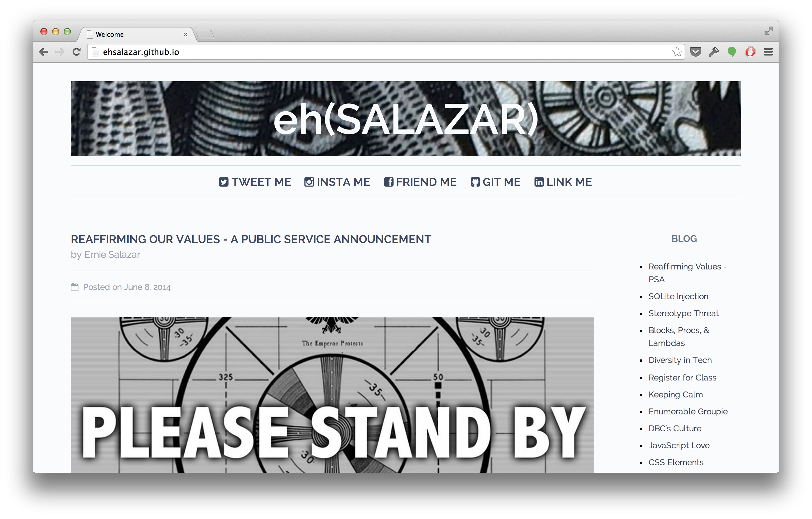

I've learned an amazing amount of technical knowledge over the course of the last eight weeks. When I began DBC's Phase 0, I only had a shallow understanding of HTML and CSS, let alone git, JavaScript, and Ruby. Now, as this phase comes to a close and I’ll soon be immersed in Phase 1, I wanted to update my site to be more functional, easier to manage and overall, more professional. 

### Out with the Old

<figure></figure>

There were a few things I wanted to accomplish as I set out to upgrade this site. First, as I’m writing more and more blog post, I needed a way to manage that process. It would also be a big help if I could automate some the work put in to each blog post. Second, while I thought the design of the site was sufficient, it still had a “made in 1995” feel about it. I knew I wanted to step up the design aspects as well as introduce a few more features.

### Jekyll

To tackle my first concern, I looked into a few different static site generators and management tools such as Middleman, Octopress and Docpad. Ultimately, I chose to go with [Jekyll](http://jekyllrb.com/). It’s powered by Ruby and runs using Gems. Some of the great features it includes are code highlighting using Pygments’ syntax, blog structuring and pagination, and the ability to create and execute posts using Markdown. Being a still relative newbie, it took a good day or two for me to figure it out and jump into with both feet. I have a basic understanding and I’m looking forward to learning more about its customizable options. 

### HPSTR

The next obstacle was in tackling the overall design. I’m proud that I was able to learn enough to get my site to look relatively good. I sought out elements I liked and taught myself how to execute them using either HTML or CSS. That said, I knew there was more I could do. I’d been exploring the possibility of utilizing Bootstrap and some of the many themes and options they provide. As I learned more about Bootstrap, I began to notice its prevalence everywhere. In the end, I found what they offered to be a bit much for my needs and it left me wanting for something a bit more unique. 

That’s when I came across [Michael Rose](http://mademistakes.com/about/), a designer out of NY state. He’s an amazing artist that does unbelievable things utilizing tools such his iPad and apps like [Paper by 53](http://www.fiftythree.com/paper). On top of that, he’s built some cool themes based around Jekyll’s functionality and has shared them with the world on Github. I chose to access his [HPSTR Theme](http://mademistakes.com/articles/hpstr-jekyll-theme/) and have found it a great match for my needs. It has a modern and minimal design with a focus on clean typography while remaining creative and artistic in a way that I felt many technical blogs lack. 

### What’s Next

This site transition has been educational and enjoyable. I’m confident I continue to spruce up sections and element here and there as I continue to get feedback from my readers. I also hope to transition to a personal URL in the near future. If you’re at all interested in learning more about this process or utilizing some of these tools as well. I suggest checking out these resources that I found incredibly helpful and inspirational.

* [Codecondo - Static Site Generators for Building Websites & Blogs](http://codecondo.com/7-static-site-generators-for-building-websites-blogs/)
* [Joshua Lande - How I Created a Beautiful and Minimal Blog Using Jekyll, Github Pages, and poole](http://joshualande.com/jekyll-github-pages-poole/)
* [Tony Leung - Site Redesign V3](http://tonykleung.info/technical/2014/06/10/site-redesign-v3/)

In the meantime, explore my new setup and feel free to share your thoughts and feedback. Thanks! 