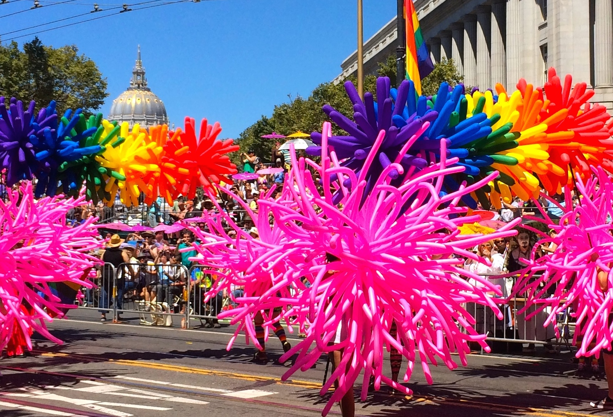

With my first full week at Dev Bootcamp in the books, I can look back and celebrate. It’s been a challenging experience so far and I have a feeling that this past week was the easiest week of them all. It’s an educational experience completely different than anything I’ve been apart of. Despite the long days and little sleep, I can’t wait to wake up tomorrow and do it all over again.

<figure></figure>

We covered a good amount of ground in just one week including Ruby basics, object-oriented programming, data structures, encoding and decoding and even recursion. All of which were then wrapped into challenges we worked on (including a Sudoku challenge on Friday that fried my brain a little). In addition to that, we’ve been encourage to read and/or skim about a 1,000 lines of code a day and 1,000 pages of programming books and articles a week.

Apart from all the technical information, I had three take-aways from this past week.

  1. This is a unique cultural and educational experience. We’re encouraged to drive and direct our own experience. The staff, instructors and coaches foster an environment where we can approach learning with enthusiasm and curiosity. At this stage, it’s all about being exposed to as much as we can handle (and then some). It’s not so much with the expectation of memorization but rather mere exposure.

  2. The social dynamic is vital. We were introduced to pair programming in Phase 0 but this takes it to a whole other level. Whether it’s working with a pair partner on a challenge, a group for check-ins or with our entire cohort on social topics for Engineering Empathy, we are challenged to be open, honest and communicative.

  3. We’re being prepared for the real world experience of being programmers, web developers and computer engineers in today’s tech industry. It’s very likely that we will one day soon be working at a start-up company. It’s also likely, if that company is highly successful, that it will be bought out by a large enterprise. While, it was not written into our curriculum, that in fact was our first week experience. Dev Bootcamp [announced](http://devbootcamp.com/2014/06/25/accelerating-the-pace-of-learning/) to us mid-week that they had been acquired by Kaplan Inc.. We’ll see what that future has in store for us, but honestly at this stage, I have more important things to focus on (see take-away one and two).

Just as my first week at Dev Bootcamp came to a close, San Francisco launched into it’s annual [LGBT Pride](http://www.sfpride.org/) celebration. While I was truly to busy to participate in it as I would have in years past. I did take a break today to enjoy the parade and celebrate. So with that in mind, here’s to pride, both in who I am, and to what I accomplished this past week.